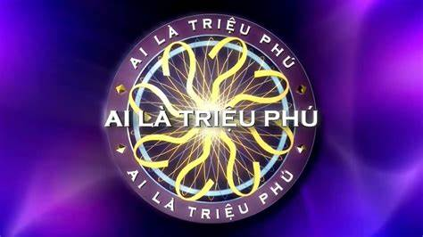

# Who-is-the-Millionaire
hust-ict-networkprogramming-capstoneproject

## Contributors
- Dao Quang Duong
- Luu Thi Thu Thao
- Hoang Thi Hang

## Features
- Có 2 chế độ chơi:
  + Chơi một mình, cuối phần thi sẽ nhận lại số câu đúng và tiền thưởng tương ứng.
  + Chế độ thách đấu: Cho phép 2 người chơi thi với nhau bằng việc cùng trả lời 1 tập câu hỏi.
- 3 quyền trợ giúp: 
  + gọi điện thoại cho người thân
  + 50/50
  + hỏi khán giả.
- Tiếp nhận và chuyển lời thách đấu giữa các người chơi.
- Kết thúc phần thi, chuyển file log chứa thông tin cuộc thi tới 2 người chơi: số câu trả lời đúng, số tiền nhận được.
### Server:
### Client:

## Installation and Running
### Installation
- VSCode  
- Ubuntu  
- gcc 
## Documentation
[SDL library in C/C++ with examples](https://www.geeksforgeeks.org/sdl-library-in-c-c-with-examples/)
